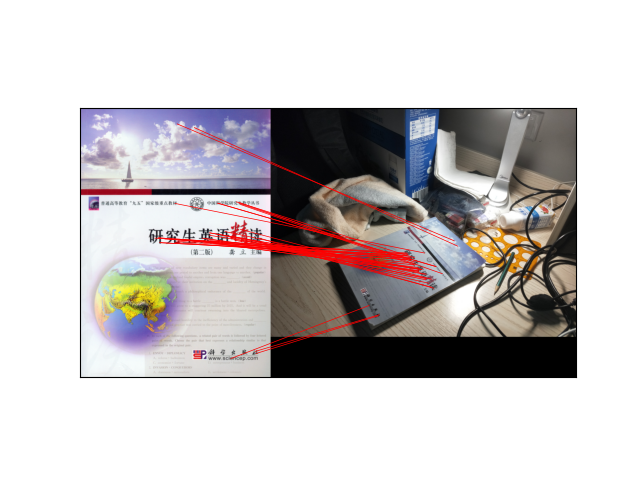

# 多媒体内容分析与理解

## 实现图像读取和颜色空间转换

- 将文件夹中的BMP图像读取，然后将RGB图像转换到YUV颜色空间并保存
- 不能调用现有的图像读取函数、颜色空间转换函数，代码自己编写

要求提交源代码和文档，发送至：三个助教之一

---

```shell
# convert image from rgb to yuv
$ ./rgb2yuv.py tests/test1.bmp tests/test1.yuv
$ ./rgb2yuv.py --help
Change rgb to yuv.

usage: rgb2yuv.py [-hVdvn] [-t <tv>] [-f <fmt>] <inp> <out>

options:
    -h, --help              Show this screen.
    -V, --version           Show version.
    -d, --debug             Print debug infomation.
    -v, --verbose           Print more information.
    -n, --dry-run           Don't output.
    -t, --tv <tv>           TV definition. [default: h]
    -f, --format <fmt>      Format of yuv. [default: i420]

TV definitions:
    s: stdanard definition.
    h: high definition.

formats:
    444:
        i444: YYYYYYYY UUUUUUUU VVVVVVVV
        yv24: YYYYYYYY VVVVVVVV UUUUUUUU
        nv24: YYYYYYYY UV UV UV UV UV UV UV UV
        nv42: YYYYYYYY VU VU VU VU VU VU VU VU
    422:
        i422: YYYYYYYY UUUU VVVV
        yv16: YYYYYYYY VVVV UUUU
        nv16: YYYYYYYY UV UV UV UV
        nv61: YYYYYYYY VU VU VU VU
    420:
        i420: YYYYYYYY UU VV
        yv12: YYYYYYYY UU VV
        nv12: YYYYYYYY UV UV
        nv21: YYYYYYYY VU VU
```

可以使用 [yuview](https://ient.github.io/YUView) 查看 yuv 格式的文件。
注意 yuv 文件不含宽高信息，需要在 yuview 中手动输入。yuview 默认格式是 nv21 。
已将该程序默认生成的 yuv 的格式设为该格式。另可使用
[imagemagick](https://www.imagemagick.org/) 或
[graphicsmagick](https://www.graphicsmagick.org/) 批量转换图片到 yuv 文件。
通过 sha256 检验生成的 yuv 文件是否正确。

与网上大量现有的使用 numpy 开发的同类程序不同，该程序使用 pytorch 开发。且利用
面向对象的方法轻松实现了对多种 yuv 格式的支持。且提供了命令行接口可以指定输入、
输出文件名。远胜同类程序。

## 图像匹配

基于以下特征，实现两幅相似图像匹配，提交源码

- SIFT
- ORB

```shell
$ ./sift.py --help
SIFT.

Use SIFT to match two pictures.

usage: sift.py [-hV] [-r <ratio>] [-o <output>] <image1> <image2>

options:
    -h, --help                  Show this screen.
    -V, --version               Show version.
    -r, --ratio <ratio>         Lowe's ratio. [default: 0.5]
    -o, --output <output>       Output to an image file.
    -n, --dry-run               Don't open the image in a window.
$ ./sift.py images/0.png images/1.png
# A window will be opened.
# Note! In my PC, it takes about 15 minutes.
$ ./sift.py -noimages/match.png images/0.png images/1.png
# No window will be opened, but an image file will be saved.
```



## 第三次课程作业

1. 阅读CycleGAN论文，自主完成一份阅读报告，要体现自己的理解与感悟；
2. 尝试运行源代码，将代码运行结果呈现在报告中；
3. 有余力的同学可自主学习代码，并加以改进（optional）。

作业提交截止日期为11月4日24点前，统一提交到ustc_media2021@163.com，文件和邮件主
题格式为：学号-姓名-第三次作业。只需要提交报告即可，无需提交源代码。

## 第四次课程作业

针对自己的相关领域进行调研，总结不同方法之间的区别和联系，并复现其中的典型方法，
比较实验效果与论文所给结果。

说明：

- 由于不同实验室拥有的服务器资源有差异，完成此项任务时可根据客观情况完成一定数
量的实验即可，复现数量不做具体要求。
- 作业提交截止日期为12月8日24点前，统一提交到ustc_media2021@163.com，文件和邮件
主题格式为：学号-姓名-第四次作业。


## 大作业 50%

- 大作业目标：给同学们一个平台，从多个方面锻炼同学们的能力，包括文献查找阅读能
力（Reading），项目动手能力（Doing），做报告的能力（Reporting）。
- 最后12课时以课堂报告的形式，大家分组完成，并在课堂上做报告。

- 题目不限（多媒体相关）
  - 本课程讲述内容：图像检索、特征降维/融合、图像分类、虚假信息检测、深度学习、
  目标检测、目标跟踪、行为分析、文字识别、医学影像分析、表情识别、行人重识
  别。。。
  - 本课程未讲述内容：多媒体信息隐藏、语音识别、推荐系统。。。
- 来源不限
  - 实验室研究课题
  - 实验室工程项目
  - 最新的论文（18年之后的CCF A类会议论文或者IEEE/ACM Trans.）不确定题目是否合
  适，可以先咨询老师

### 形式

- 103人选课，34*3+2+2或者34*3+1
- 下周上课前确定好分组，名单发给助教；找不到分组的，由助教来组合
- 做好分工、都要参与、随机提问
- PPT讲述15分钟，回答问题5分钟
- 撰写研究报告
  • 字数不限，描述清晰、分析透彻、结构完整即可
- 提交代码（不是论文阅读报告！！）
  • 需要现场演示，有界面更好

### 要求

- PPT、报告内容要有深度
  • 体现分析问题、解决问题、代码实现的能力
  • 实验充分、数据翔实
  • 阐述分析深入
- PPT、报告形式要规范美观
  • 格式、结构规范
  • 用语学术化
  • 图文并茂
  • 排版、形式美观

### 其他

- 因国庆节、运动会一共占用6课时，会补充一些课时；导致课程内容压缩，小作业只有4
次
- 多媒体内容分析与理解的最新进展，邀请到重量级嘉宾：刘海峰：合肥中科类脑智能技
术有限公司董事长兼CEO <http://www.leinao.ai/about> 预计2021年11月11日或者12日
