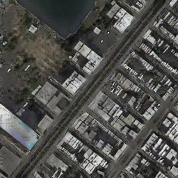
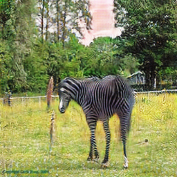

## Reflection

Cycle GAN is a network containing four submodule, two generators and two
discriminators, which are trained simultaneously. One pair of generator and
discriminator aims to discriminate the sample of dataset $Y$ and generate the
fake sample of dataset $Y$ from the dataset $X$. Another pair has the inverse
aim. We name them $D_X, G, D_Y, F$ successively.

$$\begin{aligned}
D_X: & X \rightarrow {0, 1} \\
G: & X \rightarrow Y \\
D_Y: & Y \rightarrow {0, 1} \\
F: & Y \rightarrow X
\end{aligned}$$

In `models/cycle_gan_model.py`:

```python
    def forward(self):
        """Run forward pass; called by both functions <optimize_parameters> and <test>."""
        self.fake_B = self.netG_A(self.real_A)  # G_A(A)
        self.rec_A = self.netG_B(self.fake_B)   # G_B(G_A(A))
        self.fake_A = self.netG_B(self.real_B)  # G_B(B)
        self.rec_B = self.netG_A(self.fake_A)   # G_A(G_B(B))
```

Where, `A, B` is $X, Y$.

The loss composes of three parts $\mathcal{L}_\mathrm{GAN},
\mathcal{L}_\mathrm{cyc}, \mathcal{L}_\mathrm{identity}$:

$$\begin{aligned}
\mathcal{L}(G, F, D_X, D_Y) & = \mathcal{L}_\mathrm{GAN}(G, D_Y, X, Y) +
\mathcal{L}_\mathrm{GAN}(F, D_X, X, Y) +
\lambda\mathcal{L}_\mathrm{cyc}(G, F) +
\lambda_2\mathcal{L}_\mathrm{indentity}(G, F) \\
\mathcal{L}_\mathrm{GAN}(G, D_Y, X, Y) & =
\mathrm{E}_{y \sim p_Y} \log D_Y(y) +
\mathrm{E}_{x \sim p_X} \log(1 - D_Y(G(x)))\\
\mathcal{L}_\mathrm{cyc}(G, F) & =
\mathrm{E}_{x \sim p_X} \lVert F(G(x)) - x \rVert_1 +
\mathrm{E}_{y \sim p_Y} \lVert G(F(y)) - y \rVert_1\\
\mathcal{L}_\mathrm{indentity}(G, F) & =
\mathrm{E}_{x \sim p_X} \lVert G(x) - x \rVert_1 +
\mathrm{E}_{y \sim p_Y} \lVert F(y) - y \rVert_1
\end{aligned}$$

In `models/cycle_gan_model.py`:

```python
            # define loss functions
            self.criterionGAN = networks.GANLoss(opt.gan_mode).to(self.device)  # define GAN loss.
            self.criterionCycle = torch.nn.L1Loss()
            self.criterionIdt = torch.nn.L1Loss()
```

## Run Results

### Successful Sample

#### Paired




#### Unpaired




### Failed Sample


## Improvement

CycleGAN has 2 pairs of generators and discriminators, which make it slow and
memory-intensive. To solve this problem, the Author of CycleGAN proposed a new
model named [CUT](https://github.com/taesungp/contrastive-unpaired-translation),
which is also an unpaired image-to-image translation model.
