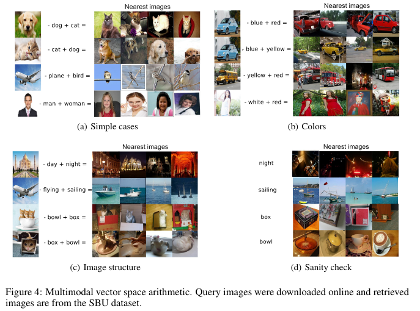
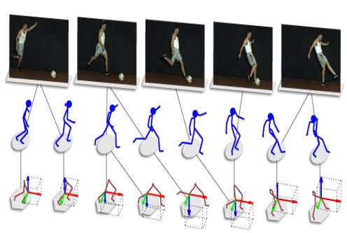
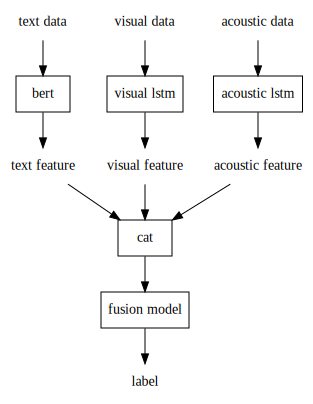
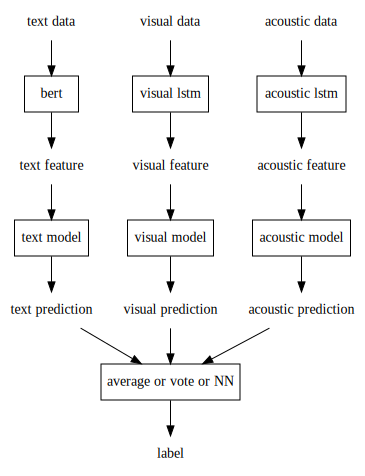
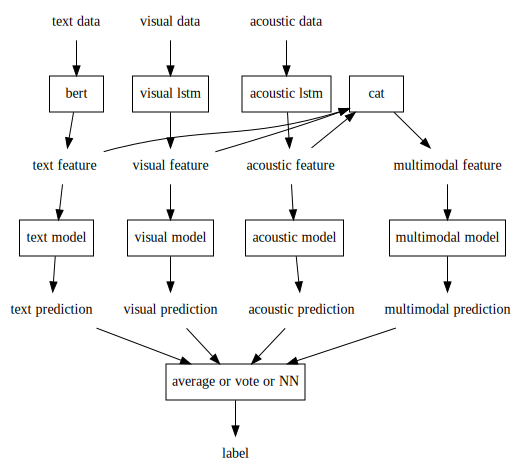
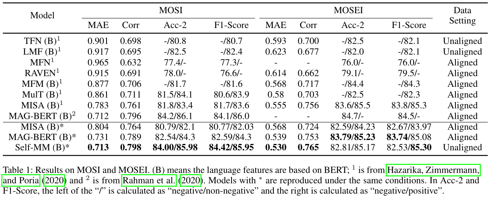

## Introduction

### Sentiment Analysis

Sentiment analysis is a typical task of machine learning. Let us use a dataset
named CMU-MOSEI to exemplify it: we collect about 22000 videos from Internet,
including their audios and subtitles, i.e., visual modality, acoustic modality
and text modality. For each sample comprised of three modalities, 6 volunteers
score its sentiment between -3 and 3, which -3 means this sample's sentiment is
very negative, and 3 means the opposite. Our task is use train set to train a
model which can predict the correct sentiment of any sample. This task can be
treated as a regression task or a classification task. Usually regression task
will achieve a better result than classification task. In the datset named
CMU-MOSEI, every label is corresponding to a sample comprised of three modality,
So we call it multimodal sentiment. If we score sentiment for each modality, we
call it unimodal sentiment or single-modal sentiment. Some datasets are
annotated with unimodal sentiment, which allow researchers use multimodal
sentiment analysis and unimodal analysis to do a multi-task learning task.

### Emotion Recognition

Emotion recognition is a task of machine learning which is confused easily with
sentiment analysis. Sentiment means positivity/negativity, while emotion means
happy, angry, fear, etc. Datasets of sentiment analysis are usually annotated
with emotion, which make we can use emotion recognition and sentiment analysis
to train a multi-task learning model in order to improve the performance of
these two tasks.

### Multimodal Learning

We can notice the above mentioned sentiment analysis/emotion recognition use
three modalities, which is different from general CV or NLP task. It is usually
categorized to multimodal learning, a research direct proposed on 1970 and
integrated tightly into deep learning on 2010. The research topic of multimodal
learning can be divided to 5 fields:

#### Multimodal representation learning

Use multimodal data to generate a better representation. It can be divided into
joint representation and coordinated representation:

$$\begin{aligned}
  \mathbf{y}_0 & = \mathbf{f}(\mathbf{x}_1, \mathbf{x}_2, \ldots, \mathbf{x}_n)\\
  \mathbf{y}_i & = \mathbf{f}_i(\mathbf{x}_i), i = 1..n\\
  \mathrm{sim}(\mathbf{y}^k_i, \mathbf{y}^k_j) & \gg
  \mathrm{sim}(\mathbf{y}^k_i, \mathbf{y}^l_j), i \neq j, k \neq l
\end{aligned}$$

Where, $\mathbf{f}$ is model. $\mathbf{x}^k_i$ means the $i$-th modality of
$k$-th sample, $n$ is the number of modalities. $\mathbf{y}^k_0$ is the joint
representation of $\mathbf{x}^k$, while $\mathbf{y}^k_i$ is the coordinated
representation of $\mathbf{x}^k$ corresponding to $i$-th modality.
$\mathrm{sim}$ is the similarity function, usually is cosine similarity.
(note, some researchers use partial order to constraint coordinated
representations.) The different modalities $\mathbf{y}^k_i, \mathbf{y}^k_j$ of
the same sample $\mathbf{x}^k$ must be more similar than the different
modalities $\mathbf{y}^k_i, \mathbf{y}^l_j$ of the different samples
$\mathbf{x}^k, \mathbf{x}^l$ -- in fact, it is a metric to evaluate the quality
of representations.

We can utilize joint representation $y_0$ to learn the joint probability
density distribution of two modalities. For given one kind of modality (e.g.,
visual images), we can get the conditional probability density distribution of
another modality (e.g, text), the text corresponding to maximum probability is
the generated tags of the given images, like Fig. [image2tag](#image2tag). An
opposite is Fig. [tag2image](#tag2image) in `Bimodal DBM`.

{#image2tag height=5cm}

{#tag2image height=5cm}

About coordinated representations, an interesting application is *Unifying
Visual-Semantic Embeddings with Multimodal Neural Language Models* as Fig.
[coordinated](#coordinated).

{#coordinated}

A difficulty is the heterogeneity of the different modalities -- the visual and
acoustic modalities is natural modalities containing plenty of redundancy,
however, the text is artificial modality which is highly symbolic.

#### Modality Translation

Except Fig. [image2tag](#image2tag) and [tag2image](#tag2image), there are many
branches in translating a modality to another modality. Such as the famous
machine translation is a translation of a text modality from a language to
another language. A difficulty is how to estimate the translation result.
For some task like lip reading or speech recognition, we have the objective correct
answer. But for other tasks (e.g., Fig. [image2tag](#image2tag) and [tag2image]
(#tag2image)), unfortunately we don't have objective answers.
Employing people to score the translation result is time-consuming and costly.
Besides the score is subjective according to the culture, religion, age, etc of
the people. However, some score method using model weakly correspond to the score
evaluated by people. So, some task (e.g., sentiment analysis) still adapt the
score evaluated by people.

#### Modality Alignment

Some researcher found align the modalities can improve the performance, like
Fig. [result](#result). Such as word-level align: cut the text modality to
words and the visual modality to sections, and let each word correspond to the
sections. Fig. [align](#align) is another example which align skeleton and
visual modality.

{#align}

In general, there are many methods to align the modalities. Some methods need
the labels of the samples, which are called supervised alignment. Unsupervised
alignment is a focus under research.

#### Multimodal Fusion

Fusion is the primary research direction in multimodal machine learning. We
need fuse different modalities to predict the label. Except some methods are
intended to be devised for some specific models, the common methods are
model-agnostic. Like early fusion, later fusion, and hybrid fusion. Like
Fig. [early](#early), [late](#late), [hybrid](#hybrid). They are called
feature-level fusion. We also have pixel-level fusion for some special case
(e.g. graph-graph fusion) like Fig. [pixel-level](#pixel-level).

Cross-modal attention (K, V comes from a modality and Q comes from another
modality) is adopted widely in model in early fusion.

{#early height=5cm}

{#late height=5cm}

{#hybrid height=5cm}

{#pixel-level height=5cm}

In general, the researcher should do ablation study about only use single
modalities will drop the performance of the model to prove the fusion is valid.

#### Co-learning

As Fig. [co-learning](#co-learning), Co-learning means using a resource rich
modality to aid another resource scarce modality.

{#co-learning}

## Related Work

Fig. [result](#result) show the recent model in sentiment analysis. Fig.
[self-mm](#self-mm) is a canonical hybrid fusion. Self-MM have a very simple
fusion model -- just a linear layer. It use a ULGM (unimodal generate module)
algorithm to generate fake unimodal sentiment labels from annotated multimodal
sentiment label and the distance between the unimodal features and multimodal
features. ("fake" means the unimodal sentiment is not annotated by people), And
do a multi-task learning of unimodal sentiment analysis and multimodal
analysis. The multi-task loss is a weighted sum of unimodal sentiment analysis
loss and multimodal analysis loss. The initial values of unimodal sentiment
labels are equal to the corresponding multimodal sentiment labels.beacuse of
the unimodal sentiment label is generated, the model is a self-supervised model
in fact. The idea is attractive. However, I found if I remove the ULGM, (i.e.,
the unimodal sentiment will always be equal to multimodal sentiment), the
result almost doesn't vary. So I think the gain maybe not come from ULGM but
other tricks. And the author still lack the ablation study of ULGM in his paper.

{#result}

{#self-mm}

Another SOTA is BBFN, as Fig. [bbfn](#bbfn). As a early-fusion, the author
fuse text and acoustic feature, text and vision feature in pair, and give up
fusing acoustic and vision features because ablation study prove it will drop
the performance. As same as previous latest SOTA, it also use cross-modal
attention to fuse the modalities, as Fig. [cross-modal](#cross-modal). Some
tricks are gated control module (GRU) in the original cross-modal attention and
a new loss about modality-sepcific feature separator.

{#bbfn}

{#cross-modal}

{#result2}

## Experiments

The following table shows the comparison between reproduce results and papers'
results.

| kind      | Model                 | Has0_acc_2 | Has0_F1_score | Non0_acc_2 | Non0_F1_score | Mult_acc_5 | Mult_acc_7 | MAE   | Corr  |
|-----------|-----------------------|------------|---------------|------------|---------------|------------|------------|-------|-------|
| reproduce | lf_dnn                | 75.32      | 76.37         | 81.51      | 81.7          | 52.09      | 51.11      | 58.04 | 70.5  |
| reproduce | tfn                   | 82.08      | 82.22         | 83.85      | 83.59         | 52.78      | 51.28      | 57.02 | 72.35 |
| reproduce | graph_mfn             | 81.88      | 82.2          | 83.82      | 83.72         | 53.34      | 52.03      | 56.58 | 72.62 |
| reproduce | self_mm               | 81.18      | 81.63         | 84.77      | 84.7          | 55.56      | 53.87      | 52.8  | 76.86 |
| reproduce | self_mm (remove ULGM) | 81.46      | 81.81         | 85.25      | 85.09         | 56.3       | 54.54      | 53.41 | 76.03 |
| paper     | lf_dnn                | 80.6       | 80.85         | 82.74      | 82.52         | 51.97      | 50.83      | 58.02 | 70.87 |
| paper     | tfn                   | 78.50      | 78.96         | 81.89      | 81.74         | 53.1       | 51.6       | 57.26 | 71.41 |
| paper     | graph_mfn             | 81.28      | 81.48         | 83.48      | 83.23         | 52.69      | 51.37      | 57.45 | 71.33 |
| paper     | self_mm               | 83.76      | 83.82         | 85.15      | 84.90         | 55.53      | 53.87      | 53.09 | 76.49 |
