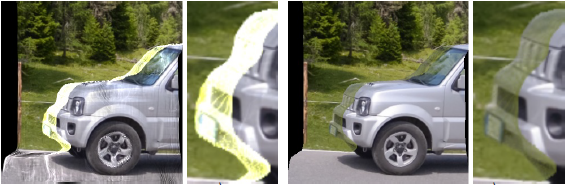
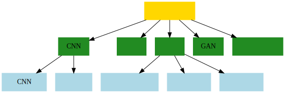
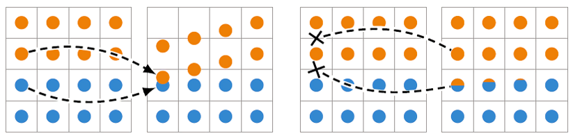
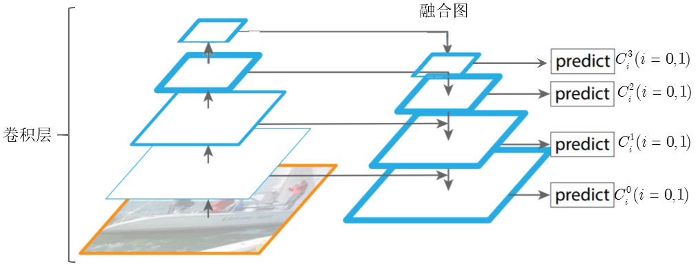
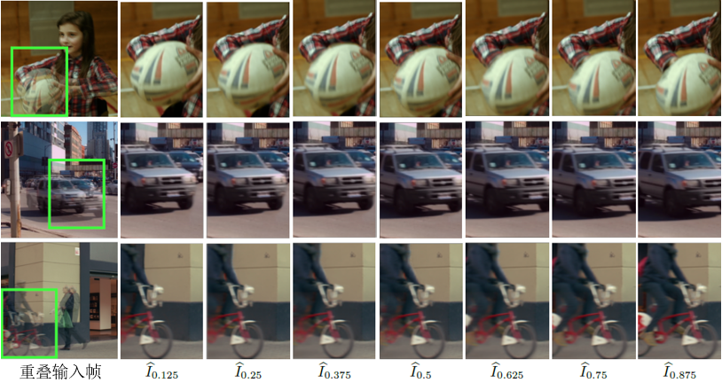

## 背景

### 视频插帧技术

计算机视觉技术在视频增强领域的应用之一，即对于已有的视频帧序列，通过在时间轴上
进行插值，将视频向高帧率转换，**改善视觉效果**。许多硬件设备的显示器刷新率已经
达到 120Hz甚至144Hz，但很多视频仍然只有30帧/秒。除了对视觉效果的改善，视频插帧
技术还被运用于**视频压缩**、**视频编辑**等领域。

::: notes
视频帧率极大地影响了视频的风格和观看体验，如图为 60fps 与 24fps 的结构对比，特
别在实时视频或运动较多的视频（例如体育赛事或视频游戏录制）中，通常需要视频具有
较高的帧率，因为短时间内发生的事件很多，许多细节性的事件需要记录，较高的帧率可
保持运动流畅、细节清晰。指定帧率放大倍数 n 后，通过视频插帧算法在输入的每两帧之
间插入 n − 1 帧，可以轻松地将帧率倍乘 n，由此实现低帧率向高帧率的转换。

// 展示球弹跳的视频
:::

## 存在的问题

### 模型推理速度慢

- 模型体积较大
- 推理环节的单个视频处理通常还包含**抽帧、去重复帧**等时间开销。

::: notes
但是，在质量上某些中间帧会出现“伪影”问题，且由于神经网络模型大，推理生成中间帧
的速度还有待提高。因此，该算法设计框架细节还需要改进，真正达到“高质量高速度”的
标准，才可以在手机等移动端、互联网云端落地应用。
:::

. . .

### 遮挡伪影

::: notes
目前，在视频处理中，基于运动估计的视频插帧算法已经得到广泛应用，但在物体剧烈运
动的场景中，插帧结果往往不太令人满意，生成的中间帧会出现类似图1.3中的遮挡/伪影
问题，其原因是运动前景与背景难以完全区分，运动估计错误造成前景和背景的遮挡。另
外，在电视中应用时有时也会出现视觉异常现象，例如一点点的撕裂或毛刺，尤其当在快
速摄影机镜头时，这些问题显得更加明显。在经过大量的相关研究工作后，插帧技术的改
进降低了伪影的显示程度，但仍很难在整体上完全消除了这种伪像。因此，在视频插帧的
任务中，不仅要能正确估计物体在多帧连续图像间的运动状况，而且要解决遮挡问题以避
免运动边界周围的严重伪像。
:::

## 常见算法

::: notes
目前，基于深度学习的视频插帧技术蓬勃发展，其中主流算法如图所示。在鲁棒性、泛化
性和学习能力等各方面都优于传统模型。在视频插帧的几类算法中，基于光流估计的视频
插帧算法提供了为解决场景复杂、光照不均等问题的框架。
:::

## 光流定义

### 光流

由物体和相机之间的相对运动而引起的物体在连续帧间的运动估计量。光流表示为
$(\mathrm{d}x, \mathrm{d}y)$关于$\mathrm{d}t$的导数，其广泛应用于目标跟踪、姿态
估计等任务。

{height=4cm}

::: notes
光流的概念最早是 Lucas 等人在 1981 年的工作中提出，该项工作对计算机视觉的发展具
有重大意义。光流是由物体和相机之间的相对运动而引起的物体在连续帧间的运动估计量，
传统的 LK 算法根据亮度一致性假设和邻域光流不变假设求解光流。
:::

## 光流定义

{height=4cm}

::: notes
见识到深度神经网络强大的学习能力后，许多研究者们开始尝试将其应用于光流估计领域，
并取得了远好于传统 LK 光流法的效果。如图为深度学习光流法的基本框架。
:::

## 光流定义

### 图像的 warp 变换

通过光流引导输入图像的 warp 变换，从而生成估计的中间帧。

{height=4cm}

::: notes
2.2.2 图像的 warp 变换
图像的变换主要包括平移、旋转、放大和缩小以及仿射变换等，warp 变换是仿射变换的一
种，在图2.5中计算出运动物体的光流后，需要通过光流引导输入图像扭曲变换从而初步生
成估计的中间帧。上述过程的扭曲变换即为 warp 变换，其通常有两种形式，分别为前向
warp 变换（forward warping）和反向 warp 变换（backward warping），应用于视频插
帧时两种方式的结果差异很大。

前向 warp 变换采用源图像到目标图像的映射方式，而反向 warp 变换为目标图像到
源图像的映射方式。

相较于前向 warp 变换而言，后向 warp 变换从目标图像中的像素点开始遍历，再
通过光流变换矩阵求其在源图像中对应像素，如果源图像中的像素坐标不是整数，则
对缺失值插值。因此后向 warp 变换不会产生前向 warp 变换的空洞和波纹等问题，在
光流引导的视频插帧算法中，也**更常使用后向 warp 变换映射输入帧到中间帧**。
:::

## 视频插帧网络

{height=5cm}

::: notes
如图，是一般的视频插帧网络的组成。
:::

## 视频插帧网络

{height=5cm}

::: notes
本代码使用的轻量级视频插帧网络主要由3个网络组成，流程为：
1. 输入帧 I0 , I1 通过中间流估计网络 IFNet 生成中间流；
2. 中间流 Ft→0 , Ft→1 引导输入帧 I0 , I1 做反向 warp 变换生成粗糙的中间帧；
3. 输入帧 I0 , I1 通过语义信息提取网络 ContextNet 得到输入两帧的金字塔特征
(4) 对金字塔特征 Cij (j = 0..3, i = 0, 1) 做反向 warp 变换得到 Ct←0 , Ct←1 ；
(5) 将中间流和粗糙的中间帧和拼接后输入 Fusion­ Net 的编码器第一个 ResNet 单元；
(6) 将每个 FusionNet 编码器的 ResNet 单元输出与同级的 Ct←0 拼接后输入下一个单元；
(7) FusionNet 解码器以编码器最后一个单元的输出作为输入，通过四层转置卷积层后生成中间帧。
:::

## 视频插帧网络

{height=5cm}

::: notes
根据“由粗到精”的设计策略，IFNet 主要有三个 IFBlock 级联构成，每个 IFBlock 都有一个
分辨率参数 Ki ，Ki 值依次增大。不同的 IFBlock 会识别不同的特征，Ki 越小表示
当前识别帧的分辨率越低，更加利于跟踪大的运动或边界，而较大的 Ki 则表示帧分辨率
越高，对识别细节丰富信息更有效。
:::

## 视频插帧网络

{height=5cm}

::: notes
通过 IFNet 生成的光流对输入帧反向 warp 变换后得到的中间帧的质量并不好，塔结构
。首先对每个输入帧 I0 , I1 通过四层卷积神经网络得到四层卷积层，即各层
均为输入帧的下采样层，下采样倍数为 {2, 4, 8, 16}。然后再将低分辨率的高层特征
采用最邻近插值的方式，修改其尺寸与下一层的特征尺寸相同，再将两个不同层级
的特征图拼接融合，构成特征金字塔的顶层。接着按照同样的步骤，依次拼接 i 层
和 i − 1 层的特征，可构成图3.6所示的特征金字塔。图中共融合出两组特征，分别为
C03 , C02 , C01 , C00 和 C13 , C12 , C11 , C10 ，这么做的好处是在图像金字塔中，
高层低分辨率特征更加抽象，其中包含更多的语义信息，而低层的高分辨率特征则包含更
多的空间信息，如此融合而成的特征金字塔既具有高分辨率又具有更多的语义信息，因此相
比于原始输入帧更加有利于综合中间帧。
:::

## 视频插帧网络

{height=5cm}

::: notes
为了融合不同层级分辨率和语义信息的 Ct←0 , Ct←1, 设计了“编码­解码”结构。在编码器
部分，将预测的中间流 Ft←0 , Ft←1 、估计的中间帧 I0 , I1 和 Ct←0 , Ct←1 拼接后组
成新的特征输入 ResNet 单元。然后将上一级的输出和 Ct←0 , Ct←1 融合组成下一级的输
入，按照此过程迭代可生成不同尺寸的融合特征图。在解码器部分，迭代将下一层特征图
和上层特征图拼接后通过转置卷积，实现上采样过程，最后网络可输出改善后的中间帧。
:::

## 数据集

{height=4cm}

::: notes
目前，Vimeo-90k 数据集因其数据量最大且帧序列均从视频中剪辑而来更符合实际情况，常
被用于插帧工作中。除了 Vimeo-90k 外，UCF101 也是非常常见的数据集。

// 可以展示数据集的视频
:::

## 评价指标

::: notes
接下来介绍 2 个指标，均为正指标，越大越好。
:::

### PSNR(峰值信噪比)

$$\begin{aligned}
  \mathrm{MSE}(\hat{I}, I) & = \frac{1}{hw}\sum_{i = 0}^{h - 1}\sum_{j = 0}^{w - 1}
  {\bigl(\hat{I}(i, j) - I(i, j)\bigr)}^2\\
  \mathrm{PSNR}(\hat{I}, I) & =
  10\lg\frac{{(2^B - 1)}^2}{\mathrm{MSE}}
\end{aligned}$$

其中，$I(i, j)$ 是图像，$h, w, B$ 是高度、宽度、量化位数。PSNR 单位是分贝。

## 评价指标

### SSIM(结构相似性指数)

$$\begin{aligned}
  l(x, y) & = \frac{2\mu_x\mu_y + \epsilon_1}{\mu_x^2 + \mu_y^2 + \epsilon_1}\\
  c(x, y) & = \frac{2\sigma_x\sigma_y + \epsilon_2}{\sigma_x^2 +
  \sigma_y^2 + \epsilon_2}\\
  s(x, y) & = \frac{2\sigma_{xy} + \epsilon_3}{\sigma_x\sigma_y + \epsilon_3}\\
  \mathrm{SSIM}(\hat{I}, I) & = {l(\hat{I}, I)}^\alpha{c(\hat{I}, I)}^\beta
  {s(\hat{I}, I)}^\gamma \in [0, 1]\\
  \epsilon_i & = {\bigl(k_i(2^B - 1)\bigr)}^2
\end{aligned}$$

其中，$\alpha, \beta, \gamma$通常取 1, $k_1, k_2, k_3$通常取0.01, 0.03, 0.03。

## 实验

{height=5cm}

::: notes
在训练过程中使用了余弦退火学习率、数据增强，共训练了 300 个 epoch。
:::

## 比较

| 方法        | PSNR  | SSIM  |
|-------------|-------|-------|
| Super Slomo | 33.15 | 0.966 |
| DAIN        | 34.71 | 0.976 |
| 本网络      | 35.35 | 0.977 |

::: notes
通过模型的比较，可以看到本模型在 2 种不同的指标上都取得了最优的结果。
:::

## 比较

::: notes
然而该模型仍存在不足之处：
:::

1. 设计的模型并不支持在 $[0, 1]$ 内的**任意时刻插帧**，只能在 $2n$ 时刻插值。若
   需要在 $t = 0.25$ 插值，则需要先在 $t = 0.5$ 插值，再在 $[0, 0.5]$ 之间插入
   $t = 0.25$ 时刻的值，暂时不支持在 $t = 0.3, 0.7$ 等时刻插值。

. . .

2. 设计的模型只使用两帧作为输入，而往往视频却有很多输入帧，也有很多研究工作证明
   使用**多帧输入**训练插帧模型能带来更好的效果。

. . .

3. 本次设计使用的评估指标为 PSNR 和 SSIM，但已有许多工作指出这些评价指标与人眼
   视觉效果不太符合，而视频插帧这种对视觉效果更注重的任务，应尝试换用
   **LPIPS（感知损失）**作为评估指标，同时使用该指标训练模型或许可以

## 插帧结果可视化

::: notes
接下来是模型展示的效果：

// 展示小女孩玩排球的视频和那个1分钟的视频
:::

{height=5cm}
